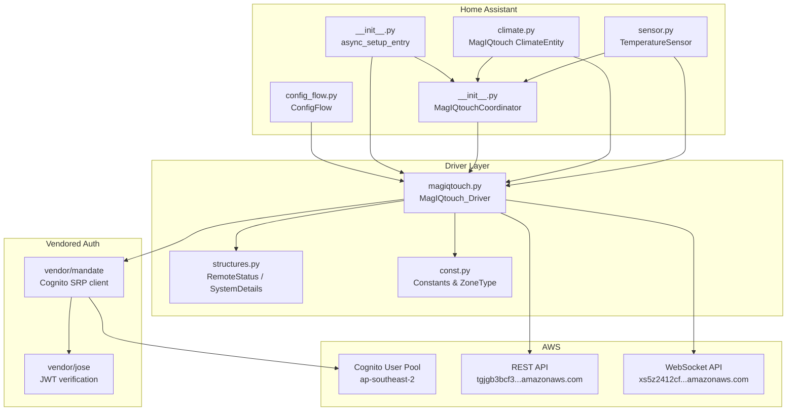
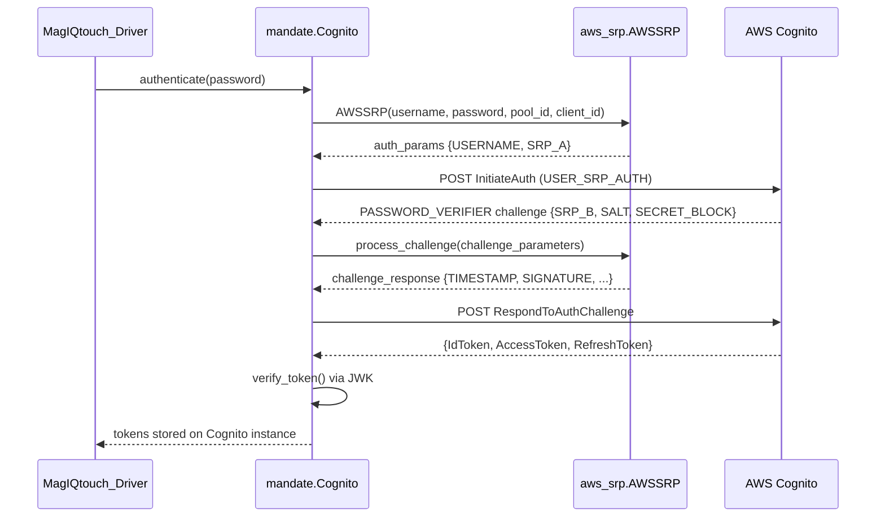
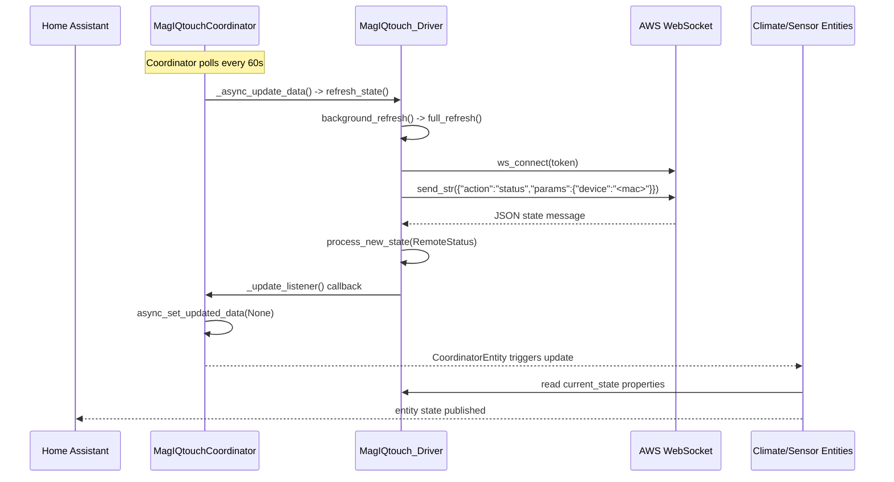

# Architecture

## Overview

This Home Assistant custom component integrates with Seeley MagIQtouch heating/cooling controllers. The controller hardware connects to AWS IoT infrastructure; this integration authenticates via AWS Cognito, fetches system configuration from a REST API, and communicates with the device in real time over WebSockets.

The integration exposes climate entities (one per zone, plus a master) and temperature sensor entities. It uses Home Assistant's `DataUpdateCoordinator` for periodic polling, but most state updates arrive via WebSocket push.

## Component Diagram



## Authentication Flow

Authentication uses AWS Cognito's SRP (Secure Remote Password) protocol. The vendored `mandate` library handles this via direct HTTPS POST requests to the Cognito service endpoint -- there is no boto3/botocore dependency at runtime despite those packages being present in the vendor directory (they are leftover from an earlier version of mandate).

The SRP flow in `vendor/mandate/client.py`:

1. `AWSSRP` generates a random keypair (`small_a`, `large_A`) using the Cognito user pool's known prime `N` and generator `g` (defined in `aws_srp.py`).
2. `InitiateAuth` is called with `AuthFlow: USER_SRP_AUTH` and `SRP_A` as the client's public value.
3. Cognito responds with `PASSWORD_VERIFIER` challenge containing `SRP_B`, `SALT`, `SECRET_BLOCK`.
4. The client computes the HKDF-derived key from the password and server parameters, then signs a challenge response.
5. `RespondToAuthChallenge` is called with the signature. Cognito returns `IdToken`, `AccessToken`, and `RefreshToken`.
6. Tokens are verified locally using the pool's JWK keys (fetched from `/.well-known/jwks.json`) via `python-jose`.

Token refresh happens automatically in `check_token()` (`client.py:102`), which is called before each WebSocket connection via `_get_token()` (`magiqtouch.py:334`). If the access token is expired, `renew_access_token()` uses the refresh token to obtain new tokens without re-authenticating.



## Data Flow: Device to HA Entities



On startup, `async_setup_entry` (`__init__.py:45`) restores persisted state from the config entry before setting up platforms. This allows entities to report state immediately rather than waiting for the first WebSocket response.

## State Management

### Two State Objects

The driver maintains two state objects:

- **`current_state`** (`RemoteStatus`, `structures.py:429`): The real-time operational state of the system. Contains `systemOn`, `runningMode`, and lists of `UnitDetails` for `cooler` and `heater` devices. Each `UnitDetails` carries per-zone data: `set_temp`, `internal_temp`, `fan_speed`, `control_mode`, `zoneOn`, etc.

- **`current_system_state`** (`SystemDetails`, `structures.py:324`): The static hardware configuration. Contains zone definitions (`ACZones.Zones`), installed equipment (`Heater`, `EVAPCooler`, `AOCFixed`, `AOCInverter`), and the WiFi module's MAC address used as the device identifier.

### RemoteStatus.update() -- In-Place Mutation

`RemoteStatus.update()` (`structures.py:443`) merges new state into the existing object rather than replacing it. This is significant: all `UnitDetails` objects in the `cooler` and `heater` lists are updated in-place by iterating field-by-field. Nested dataclass fields (`fan`, `installed`) are also updated field-by-field. This means references held by climate entities to specific `UnitDetails` objects remain valid across state updates.

### Optimistic Updates

When the driver sends a command (e.g., `set_temperature`, `set_on`), it modifies `current_state` _before_ sending the WebSocket message. For example, in `set_off()` (`magiqtouch.py:533`):

```python
self.current_state.systemOn = False
checker = lambda state: (not state.systemOn)
await self.send_current_state(checker)
```

The local state is mutated first, then the full state is serialized and sent as a `command` action. A `checker` callback is provided to verify the device echoed back the expected change. If the checker never matches (timeout), `send_current_state()` triggers a `background_refresh()` to re-sync local state with the device (`magiqtouch.py:443`).

### RemoteStatus Equality

`RemoteStatus.__eq__` (`structures.py:477`) flattens both objects to dicts and excludes fields containing "actual" (sensor readings) and `timestamp`. This means equality checks compare only the controllable/settable state, ignoring transient sensor values.

## Climate Entity Structure

### Entity Creation

One `MagIQtouch` climate entity is created per entry in `driver.zone_list` (`climate.py:82`). The zone list is built by `update_zone_list()` (`magiqtouch.py:456`).

### Master Zone vs Individual Zones

An entity's `master_zone` flag (`climate.py:110`) is `True` when `zone` is `None`, `ZONE_NONE`, or `ZONE_COMMON`. Master zone entities:

- Support `FAN_MODE` and `PRESET_MODE` features (individual zones do not)
- Can switch between HVAC modes (cool/heat/fan)
- Turn the whole system on/off

Individual zone entities:

- Can only turn their own zone on/off (via `set_zone_onoff`)
- Report the system's current HVAC mode but cannot change it
- Report `HVACAction.OFF` if their zone is off even when the system is on
- Report `HVACAction.IDLE` if the system is in a mode their zone doesn't support (e.g., heating mode in a cool-only zone)

### master_mode_only_controller

If a zone has no coolers or heaters matched to it by `zone_match`, `master_mode_only_controller` is set to `True` (`climate.py:138`). In this case, the entity falls back to using the full cooler/heater lists from `current_state` and loses `TARGET_TEMPERATURE` support. This handles edge cases where zone configuration doesn't match available hardware.

### HVAC Mode and Action Mapping

`runningMode` string values from the device map to HA modes as follows:

| `runningMode` | `hvac_mode` | `hvac_action` |
|---|---|---|
| `COOL` | `HVACMode.COOL` | `HVACAction.COOLING` |
| `HEAT` | `HVACMode.HEAT` | `HVACAction.HEATING` |
| `COOLER_FAN` | `HVACMode.FAN_ONLY` | `HVACAction.FAN` |
| `HEATER_FAN` | `HVACMode.FAN_ONLY` | `HVACAction.FAN` |

### Presets

Presets combine the running mode with the control mode (temperature setpoint vs fan speed). The master entity exposes presets like "Cooling: set temperature", "Heating: set fan speed", "Fan: Fresh Air" (evap fan), and "Fan: Recirculate" (heater fan). These are defined in `climate.py:63-70`.

## WebSocket Communication

### Message Types

Two WebSocket message types are used:

- **Status request**: `{"action": "status", "params": {"device": "<mac>"}}`
  Requests the current device state. The device responds with one or more JSON messages containing `RemoteStatus` data.

- **Command**: `{"action": "command", "params": { ... full RemoteStatus dict ... }}`
  Sends the desired state to the device. The full `RemoteStatus` is serialized and sent; the device echoes back the new state.

### Job Queue and Checker Callbacks

Each WebSocket interaction is wrapped in a `WebsocketJob` dataclass (`magiqtouch.py:714`):

```
WebsocketJob(message, checker, status, timeout, ws)
```

The `checker` is a callable that receives each incoming `RemoteStatus` and returns `True` when the expected response arrives. When the checker matches:

1. The job's status is set to `"confirmed"`
2. The checker is cleared (set to `None`)
3. The new state is processed via `process_new_state()`
4. If this was a command (not a status refresh), a background refresh WebSocket is started
5. The WebSocket is closed

If no checker is provided (background refresh), all incoming messages are passed to `process_new_state()` and the WebSocket stays open until timeout or close.

### Connection Lifecycle

`ws_handler()` (`magiqtouch.py:186`) manages the WebSocket lifecycle:

- A new WebSocket connection is opened for each job
- On connect, any existing background (checker-less) WebSocket jobs are closed to prevent stale background refreshes from overwriting command results
- The connection auto-closes after 45 minutes to stay within the Cognito token's 1-hour lifetime
- The `self.jobs` list tracks active WebSocket connections

### Error Handling

If `ws_send()` times out (`magiqtouch.py:175`), it returns `False`. `send_current_state()` checks this return value and triggers a `background_refresh()` to re-sync state (`magiqtouch.py:443`). The coordinator's `_async_update_data()` catches exceptions and falls back to a full re-login (`__init__.py:140`).

## Zone Management

### Zone Types

Defined in `const.py`:

- **`ZONE_NONE`** (`ZoneType("NONE", None)`): Used for single-zone systems where `NoOfZoneControls == 0`. One climate entity is created.
- **`ZONE_COMMON`** (`ZoneType("COMMON", None)`): The master zone in multi-zone systems. Always created when zones exist. Controls the whole system.
- **Individual zones**: Created from `UnitDetails` entries in `current_state.cooler` and `current_state.heater` whose `zoneType` is not `"COMMON"`. Each gets a `ZoneType(zoneType, name)` namedtuple.

`ZoneType` is a `namedtuple("ZoneType", ("type", "name"))`, providing value-based equality and hashability. The `update_zone_list()` method (`magiqtouch.py:456`) uses a `set[ZoneType]` for deduplication across cooler and heater device lists.

### zone_match

`zone_match(dev, zone)` (`magiqtouch.py:472`) determines whether a `UnitDetails` device belongs to a given zone:

```python
(zone in (ZONE_NONE, ZONE_COMMON) and dev.zoneType == zone.type) or (
    ZoneType(dev.zoneType, dev.name) == zone
)
```

For `ZONE_NONE` and `ZONE_COMMON`, it matches on `zoneType` string alone (ignoring name). For individual zones, it constructs a `ZoneType` from the device's fields and compares by value.

### Zone Caching

`available_coolers()` and `available_heaters()` (`magiqtouch.py:477-491`) cache their results in `_zone_coolers` and `_zone_heaters` dicts, keyed by zone. These caches are never explicitly invalidated -- they persist for the lifetime of the driver instance. If zone configuration changes, a config entry reload creates a new driver instance.

## Config Persistence

### What Gets Saved

`update_config_data()` (`magiqtouch.py:384`) writes four keys to the config entry's `data` dict:

| Key | Constant | Content |
|---|---|---|
| `"state"` | `CONF.STATE` | `current_state.to_dict()` -- full `RemoteStatus` as dict |
| `"system_state"` | `CONF.SYS_STATE` | `current_system_state.to_dict()` -- full `SystemDetails` as dict |
| `"zone_list"` | `CONF.ZONES` | `zone_list` -- list of `ZoneType` namedtuples (serialized as lists) |
| `"title"` | `CONF.TITLE` | Device display name |

### Restore on Startup

`async_setup_entry()` (`__init__.py:45`) restores state in order:

1. `CONF.SYS_STATE` -> `driver.set_system_state(SystemDetails.from_dict(state))` -- this also sets `_mac_address`, `_refresh_msg`, `device_id`, and `device_name`.
2. `CONF.ZONES` -> `driver.zone_list` -- reconstructed as `ZoneType` namedtuples.
3. `CONF.STATE` -> `driver.current_state = RemoteStatus.from_dict(state)`.

If any of these are missing, `full_refresh()` is called with `initial=True`, which triggers login, system details fetch, and a WebSocket status request.

### Save Triggers

`save_config_data()` (`magiqtouch.py:375`) is called from `full_refresh()` after state is received. If `_config_update_required` is set (triggered by system state changes or zone list changes), the config entry is updated and then reloaded via `async_reload()`, which tears down and re-creates all entities.

## Vendored Dependencies

The `vendor/` directory is added to `sys.path` at import time (`__init__.py:5-6`). This runs before any other imports in the package.

### What's Vendored

| Package | Purpose |
|---|---|
| `mandate` | AWS Cognito SRP authentication client. Forked/modified to use direct HTTPS calls instead of boto3. |
| `jose` (python-jose) | JWT decoding and verification for Cognito tokens. |
| `ecdsa`, `pyasn1`, `rsa` | Cryptographic dependencies of python-jose for JWK/RS256 verification. |
| `aioboto3`, `aiobotocore`, `botocore`, `urllib3`, `dateutil` | Residual dependencies from an earlier version of mandate that used boto3. No longer used at runtime since mandate was rewritten to use direct HTTPS. |

### Why Vendored

Home Assistant's custom component environment does not support declaring pip dependencies that get installed automatically. HACS installs the component files as-is. Vendoring ensures all required libraries are present without requiring manual pip installation by the user.

The `mandate` library in particular has been modified from its upstream version to remove the boto3 dependency entirely, replacing it with direct `aiohttp` POST requests to the Cognito HTTPS endpoint (`vendor/mandate/client.py:43`). This was necessary because boto3 is large, not async-native, and not commonly available in Home Assistant environments.

## Sensor Platform

`sensor.py` creates `TemperatureSensor` entities -- one per zone for internal temperature, plus an optional external air temperature sensor if `ExternalAirSensorPresent` is true in the system configuration.

Sensors use the coordinator pattern (`CoordinatorEntity`) but override `_handle_coordinator_update()` to read their value via a `data_callback` lambda that calls `driver.active_device(zone).internal_temp` (or `.external_temp`). The `should_poll` property returns `False`; updates are purely push-driven through the coordinator.

## File Reference

| File | Role |
|---|---|
| `__init__.py` | Entry point. Config entry setup, state restore, coordinator definition. |
| `magiqtouch.py` | Driver. Auth, WebSocket, REST API, state management, command methods. |
| `climate.py` | Climate entity. HVAC modes, fan control, presets, zone-aware properties. |
| `sensor.py` | Temperature sensor entities. |
| `config_flow.py` | UI config flow for credentials. Options flow for verbose logging toggle. |
| `structures.py` | Dataclass definitions for `RemoteStatus`, `SystemDetails`, `UnitDetails`, etc. |
| `const.py` | Constants: domain, modes, zone types, config keys, scan interval. |
| `vendor/mandate/client.py` | Cognito auth client. SRP flow, token management, JWT verification. |
| `vendor/mandate/aws_srp.py` | SRP protocol math. Key generation, challenge processing, HKDF. |
